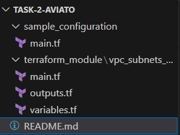

# Terraform Module: VPC, Subnets, and Cloud Run Service

This Terraform module sets up a VPC network, subnets, and a Cloud Run service in Google Cloud. The module is designed to be reusable and configurable, allowing us to specify various parameters for creating and managing infrastructure.

## Module Structure

The module consists of the following components:
- **VPC Network**: Creates a Virtual Private Cloud (VPC) network.
- **Subnets**: Creates multiple subnets within the VPC.
- **Cloud Run Service**: Deploys a Cloud Run service with specified container configuration.
- **IAM Policy**: Configures IAM policies to allow public access to the Cloud Run service.

## Input Variables

The module accepts the following input variables:

- `project_id`: The ID of the Google Cloud project.
- `region`: The region where resources will be created.
- `vpc_name`: The name of the VPC network.
- `vpc_cidr`: The CIDR block for the VPC network.
- `subnet_cidrs`: A list of CIDR blocks for the subnets.
- `service_name`: The name of the Cloud Run service.
- `memory`: Memory allocation for the Cloud Run service (e.g., "256Mi").
- `container_port`: The port that the container exposes.

## Outputs

The module provides the following outputs:

- `vpc_network_name`: The name of the VPC network.
- `vpc_network_cidr`: The CIDR block of the VPC network.
- `subnet_names`: The names of the subnets.
- `subnet_cidrs`: The CIDR blocks of the subnets.
- `cloud_run_service_location`: The location of the Cloud Run service.
- `cloud_run_service_name`: The name of the Cloud Run service.
- `cloud_run_service_invoker_role`: IAM role assigned to the public access policy for Cloud Run service.

## Usage

- This Terraform module is useful for quickly setting up a network environment in Google Cloud. It’s ideal for:

- Creating a VPC and Subnets: Easily establish isolated network environments for development or production.

- Deploying Cloud Run Services: Deploy and manage containerized applications with a fully configured network setup.

### Module Directory Structure

